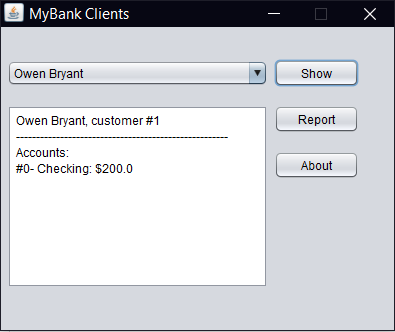
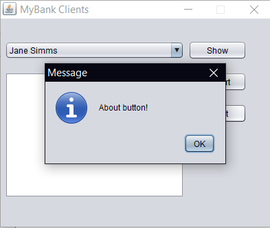

# UI Lab 4

## На "чотири"
1. Доповніть код таким чином, щоб з файлу **test.dat** (робота номер 8, [файл даних](https://github.com/ppc-ntu-khpi/GUI-Lab2-Starter/blob/master/data/test.dat) також є в цьому ж репозиторію) читалась інформація про клієнтів банку та їх рахунки 
2. Напишіть обробники подій для елементів керування, завдяки яким би при виборі клієнта та натисненні кнопки **Show** виводилась інформація про нього та всі його рахунки
3. Кнопка **About** має демонструвати діалогове вікно з інформацією про програму та її розробників (**[JOptionPane](https://docs.oracle.com/javase/7/docs/api/javax/swing/JOptionPane.html)**)
3. Запустіть проект, впевніться, що все працює як очікувалось. Продемонстрируйте результат викладачеві.